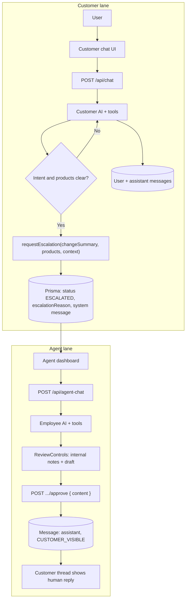
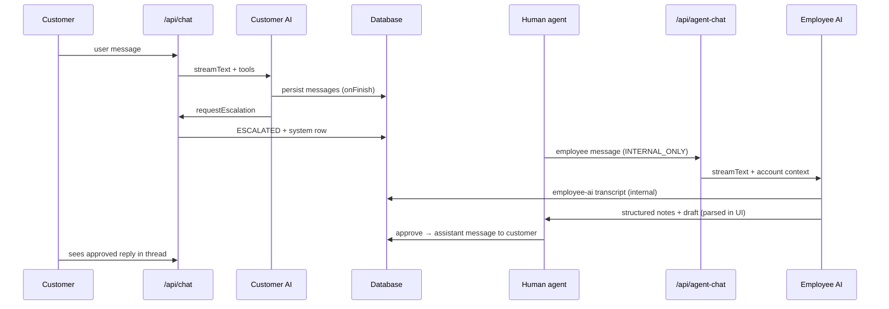

<!-- BEGIN:nextjs-agent-rules -->
# This is NOT the Next.js you know

This version has breaking changes — APIs, conventions, and file structure may all differ from your training data. Read the relevant guide in `node_modules/next/dist/docs/` before writing any code. Heed deprecation notices.
<!-- END:nextjs-agent-rules -->

# Agent architecture & design

This document describes how customer AI, employee AI, persistence, and UI fit together in this repo. For stack-specific API notes, see **Project notes** below.

## Project notes (stack)

- AI SDK v6 uses `inputSchema` (not `parameters`) for tool definitions.
- AI SDK v6 `useChat` uses `transport: new DefaultChatTransport({ api })` (not `api` directly).
- AI SDK v6 `streamText` uses `stopWhen: stepCountIs(n)` (not `maxSteps`).
- Prisma 7 uses `prisma.config.ts` for datasource URL (not `url` in `schema.prisma`).
- Prisma 7 requires `@prisma/adapter-better-sqlite3` at runtime.

---

## High-level architecture

The app models **two lanes**:

1. **Customer AI** — Public docs + read-only account/invoice tools. Cannot change subscriptions or billing; escalates to a human when intent is clear and a handoff is needed.
2. **Employee AI** — Backs the human agent: public + **internal** docs, full account read/write tools, structured **internal notes** vs **draft customer reply**.

**Persistence** is SQLite via Prisma: `CustomerAccount`, `Invoice`, `Conversation`, `Message`. Messages use `audience` (`CUSTOMER_VISIBLE` vs `INTERNAL_ONLY`) so employee↔AI chat does not appear in the customer thread.

**Primary surfaces**

| Route / area | Purpose |
|--------------|---------|
| `src/app/page.tsx` | Split view: customer chat + agent panel |
| `src/app/customer/page.tsx` | Standalone customer chat (`?email=`) |
| `src/app/agent/page.tsx` | Agent dashboard: escalations list + thread + employee AI |

---

## Customer AI (`/api/chat`)

- **Model & system prompt:** `src/lib/agents/customer.ts`, `CUSTOMER_SYSTEM` + `CUSTOMER_RESPONSE_FORMAT_INSTRUCTION` from `src/lib/types.ts`.
- **Tools:** `searchPublicDocs`, `getAccountInfo`, `listInvoices`, and an inline `requestEscalation` tool **defined in** `src/app/api/chat/route.ts` (uses `escalation-handoff.ts`). The standalone `src/lib/agents/tools/escalation.ts` is not imported by that route — keep schema changes in `escalation-handoff.ts` + the route tool.
- **Streaming:** `streamText` with `stopWhen: stepCountIs(8)` to allow multi-step gather + tools.
- **Persistence:** Creates conversation if needed; stores last user message; `onFinish` persists assistant text; escalation tool + backup scan in `onFinish` set `ESCALATED` and system line.

### Design choices (customer)

- **Gather first, then escalate:** The model is instructed to clarify **what** the customer wants and **which products** (from `getAccountInfo`) before calling `requestEscalation`. Deeper discovery (retention, contract detail) is deferred to post-escalation human/employee flow.
- **Structured handoff:** `requestEscalation` uses `src/lib/agents/tools/escalation-handoff.ts` — `changeSummary`, `productsInvolved[]`, optional `contextForAgent`. `buildEscalationReason()` flattens that into `escalationReason` + customer-visible system message.
- **Suggested chips (`suggestedQuestions`):** Treated as **the customer’s next message** when tapped. Must be **customer voice** (e.g. product names, “Upgrade”, “Downgrade”) — not agent questions (“Are you looking to…?”). For product pickers, chips are **name-only**; prose should not duplicate the same list (avoid triple redundancy: bullets + bullets + chips).
- **Response shape:** Markdown body, then `---METADATA---`, then JSON with `citations` + `suggestedQuestions`. Parsed by `parseCustomerResponse` in `src/lib/parse-response.ts` for display and chips.

---

## Employee AI (`/api/agent-chat`)

- **Model & system prompt:** `src/lib/agents/employee.ts` + `EMPLOYEE_RESPONSE_FORMAT_INSTRUCTION` in `src/lib/types.ts`.
- **Tools:** `searchPublicDocs`, `searchInternalDocs`, `getAccountInfo`, `listInvoices`, `updateAccount`, `createCreditMemo`.
- **Context injection:** Route loads conversation + customer account; appends **customer profile**, **escalation reason**, and **customer-visible message history** to the system prompt. Employee `useChat` messages are persisted as `role: employee`, `audience: INTERNAL_ONLY`.
- **Streaming:** `stopWhen: stepCountIs(8)`; `onFinish` stores full assistant text as `employee-ai` / internal-only for audit.

### Design choices (employee)

- **Strict separation:** `---INTERNAL NOTES---` = agent-only (internal docs, risk, runbook logic). `---DRAFT CUSTOMER RESPONSE---` = **only** text safe to send to the customer; must be valid markdown for `MarkdownContent`, no internal secrets. `---METADATA---` JSON lists citations; internal-doc entries support notes; public/account/invoice entries support the draft.
- **Unstructured replies:** If the model returns **no** delimiter sections, `parseEmployeeResponse` treats the entire body as **internal notes** and leaves **draft empty** — so conversational answers to the employee never populate the customer draft by accident.
- **Prompt emphasis:** Internal notes should be dense (escalation recap, thread snapshot, facts, gaps, probable customer moves, clarifiers, upsell ideas). Draft should be the **best next customer message**, ready to send.

---

## Human-approved reply to customer

- **POST** ` /api/conversations/[id]/approve` with `{ content }` — creates `Message` with `role: assistant`, `audience: CUSTOMER_VISIBLE`.
- **UI:** `ReviewControls` shows internal notes (markdown-rendered) + editable draft + Send. Internal notes use `MarkdownContent`; draft is a textarea (markdown sent as-is).

---

## Escalation & status

- Conversation `status` transitions include `WITH_CUSTOMER_AI` → `ESCALATED` (and optionally resolved elsewhere).
- Customer-visible system row: `Escalated to human agent: …` with built reason string.
- **Client:** Escalation reason for banners is extracted from tool parts (`tool-requestEscalation`) via `src/lib/escalation-ui.ts`, with prose fallback helper where needed.

### End-to-end flow (diagram)

---

## API map (App Router)

| Endpoint | Role |
|----------|------|
| `POST /api/chat` | Customer AI stream; sets `X-Conversation-Id` |
| `POST /api/agent-chat` | Employee AI stream (requires `conversationId`) |
| `GET /api/conversations` | List escalations + enriched customer snapshot |
| `POST /api/conversations/[id]/approve` | Post human-approved customer message |
| `GET /api/invoices/download?key=…` | Invoice PDF proxy |
| `POST /api/chat/classify` | Optional classifier / alternate path (not the primary customer flow if the app calls `/api/chat` directly) |
| `POST /api/escalate` | Manual escalation helper (if used) |

---

## UI layout (agent workspace)

- **Single scroll column:** Customer thread (including escalation banner) and the employee workspace (Employee AI transcript, input, `ReviewControls`) live in **one** `overflow-y-auto` region so nothing is trapped in a 50%-height pane with independent scroll.
- **Thread labels:** `getAssistantThreadKind` in `agent-message-body.tsx` distinguishes customer AI vs human agent messages after escalation for correct bubbles.

---

## Key files (quick reference)

| Area | Files |
|------|--------|
| Customer agent | `src/lib/agents/customer.ts`, `src/lib/types.ts` (customer format) |
| Employee agent | `src/lib/agents/employee.ts`, `src/lib/types.ts` (employee format) |
| Escalation schema | `src/lib/agents/tools/escalation-handoff.ts` |
| Chat API | `src/app/api/chat/route.ts` |
| Agent chat API | `src/app/api/agent-chat/route.ts` |
| Parsing | `src/lib/parse-response.ts` |
| Escalation UI helpers | `src/lib/escalation-ui.ts` |
| Agent UI | `src/components/agent-dashboard/review-controls.tsx`, `agent-message-body.tsx` |

---

## Conventions for future changes

- Keep **customer** and **employee** format instructions in `src/lib/types.ts` aligned with prompts; avoid duplicating conflicting rules in multiple markdown files unless necessary.
- Any new tool used in `/api/chat` should be reflected in `CUSTOMER_SYSTEM` and tested for streaming + persistence.
- Employee-facing markdown in ReviewControls should remain **GitHub-flavored** and safe for `react-markdown` + `remark-gfm` (`src/components/markdown-content.tsx`).
